# The CLIMB Project
[<u>**C**</u>osmological <u>**L**</u>ambdaCDM Simulations for <u>**I**</u>nference with <u>**M**</u>achine Learning and <u>**B**</u>ayesian statistics]

The project aims to build a Simulation-based Inference pipeline that predicts the four cosmological parameters {$\Omega_{\Lambda}$, $\Omega_m$, $\Omega_b$, h} from Lyman-$\alpha$ forest spectra. For this purpose 50 simulations are run with varied cosmological parameters using the TNG-Arepo code ([Pillepich et al. 2017](https://academic.oup.com/mnras/article/473/3/4077/4494369)) evolving the simulated boxes from $z=127$ until today. Our boxes have a size of $25^3$ cMpc$^3/h$ with $256$ particles per dimension. Initial conditions are created with the MUSIC code ([Hahn and Abel 2011](https://academic.oup.com/mnras/article/415/3/2101/1045260)) and the random initial seed is the same for all 50 boxes. 500,000 spectra are created from snapshots at $z=2$ using the TEMET package ([Nelson et al. 2025](https://arxiv.org/abs/2510.19904)). A Transformer Neural Network is trained on these spectra and then applied to observed spectra from the SDSS survey (DR9) ([Lee et al. 2013](https://arxiv.org/abs/1211.5146)) to test the goodness of the pipeline.

A selection of some of the plots from the project can be found below.

## Simulations
Projection of the mean density of neutral hydrogen at $z=2$ for 20 of the CLIMB boxes ordered by $\Omega_b$. The filamentary cosmic web structure is clearly visible, with variations in the neutral hydrogen distribution reflecting differences in baryon content between the cosmologies:
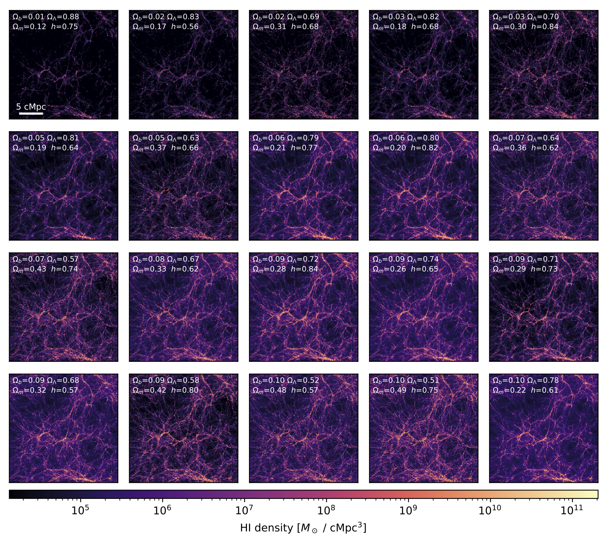

---
Gas and Dark Matter for the most massive halo in 10 of the boxes from the CLIMB suite at z = 0. The gray circles represent the regions, where the mean density is larger than 500 times the
critical density of the universe.
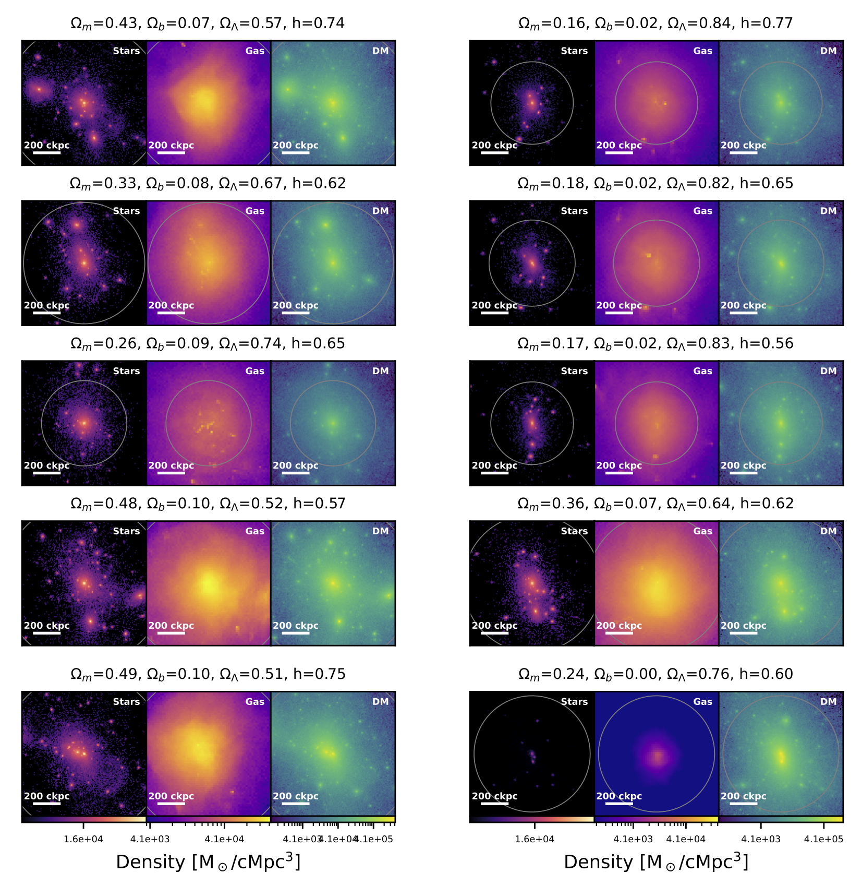

---
Halo mass function for all 50 simulated boxes of the CLIMB suite. The shape of all lines have
a similar slope, however they show a shift in the number of halos for different cosmologies. Three reference
lines from the TNG50, TNG100 and TNG300 simulations ([Nelson et al. 2021](https://arxiv.org/abs/1812.05609)) are shown as black lines.
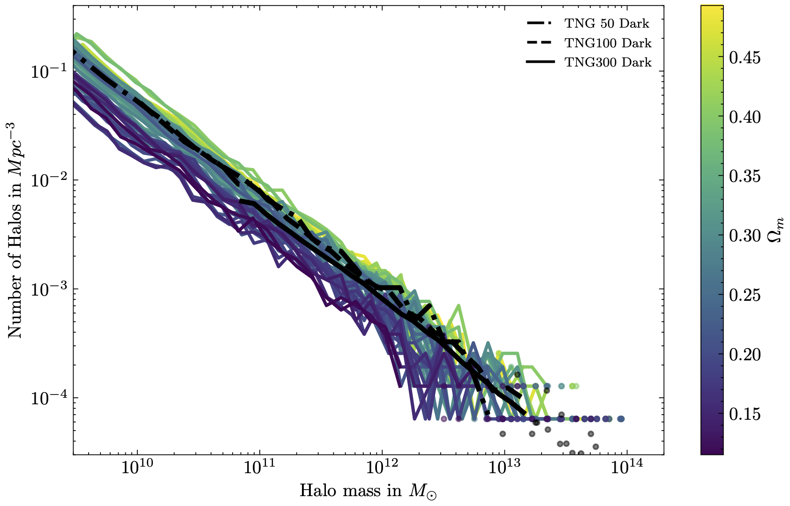

---
Comparison of the CLIMB suits to other works with varying cosmologies. All plots shown here are made from CLIMB high. 
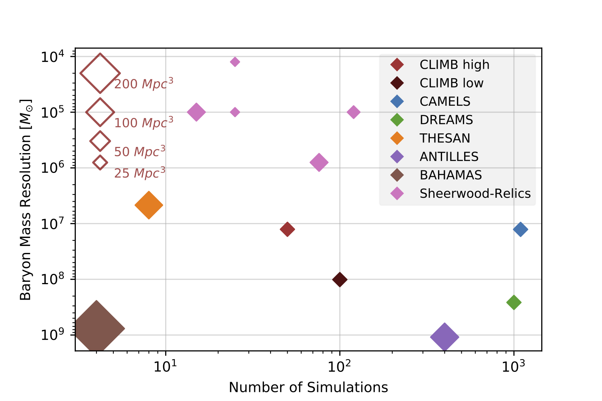

## Spectra generation
Example gallery of single spectra created from the CLIMB high simulations using [TEMET](https://github.com/nelson-group/temet). All spectra shown were made from the same box and different lines of sight.
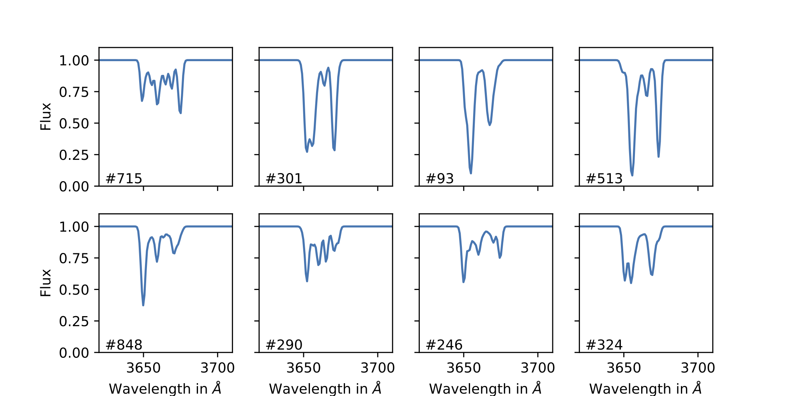

---
To increase the amount of information per input spectrum and allow the network to use longer sections of real spectra in the inference mode, the spectra are augmented. Different short spectra (upper panel) are randomly shuffled and
patched together to make one long spectrum (lower panel).
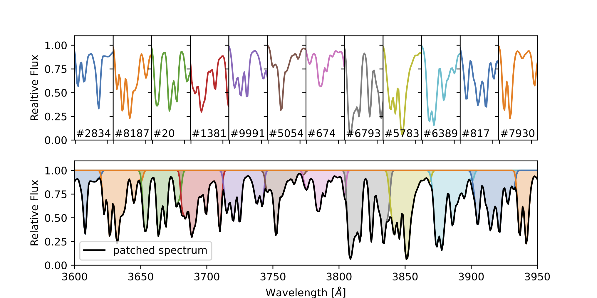

---
Comparison of different noise models. In the upper plot no noise is added to the synthetic
spectrum. In the middle plot a constant random Gaussian noise with Signal-to-noise (SNR) 5 is added. In
the lower plot the mean SNR ratio per pixel of the SDSS catalog spectra with median SNR > 5 is assumed.
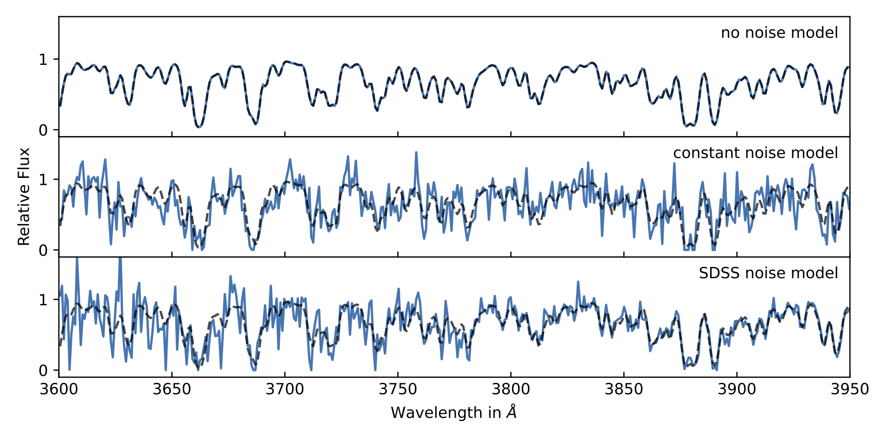

---
As a reference, two observed spectra from the SDSS DR9 Lyman alpha catalog.
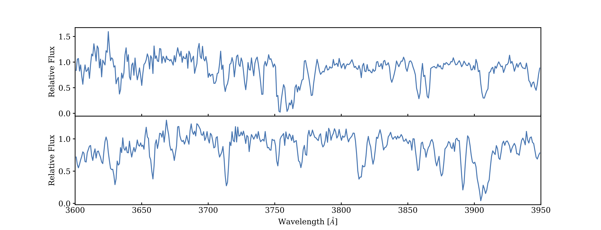

### Transformer Model
Flow chart of the Transformer Network used in this work. The final model has about 4 million trainable parameters.
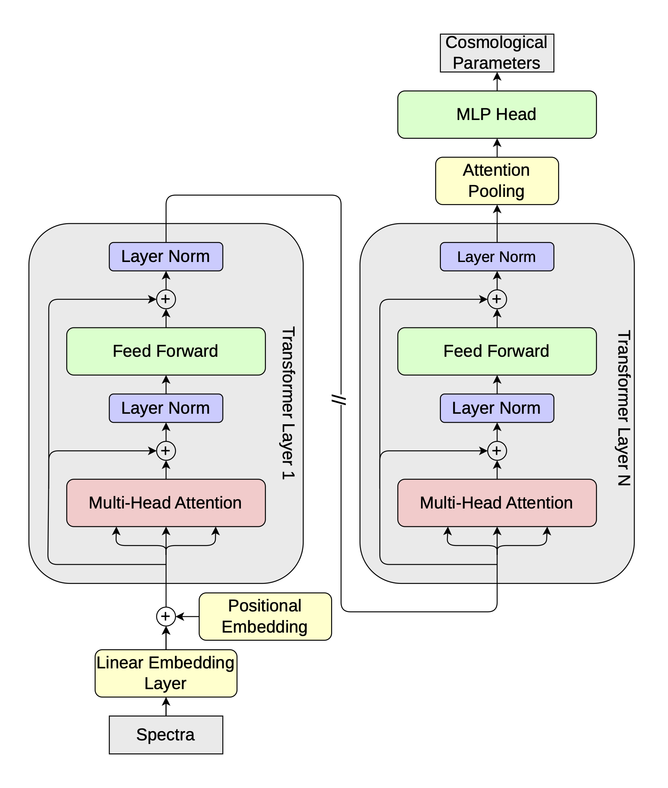

---
From the 500,00 available spectra 70% is used as a training set, 15% for a validation set and 15% for a test set. The Transformer is trained for 6 Epochs on the trainind dataset. An example training curve can be seen here.
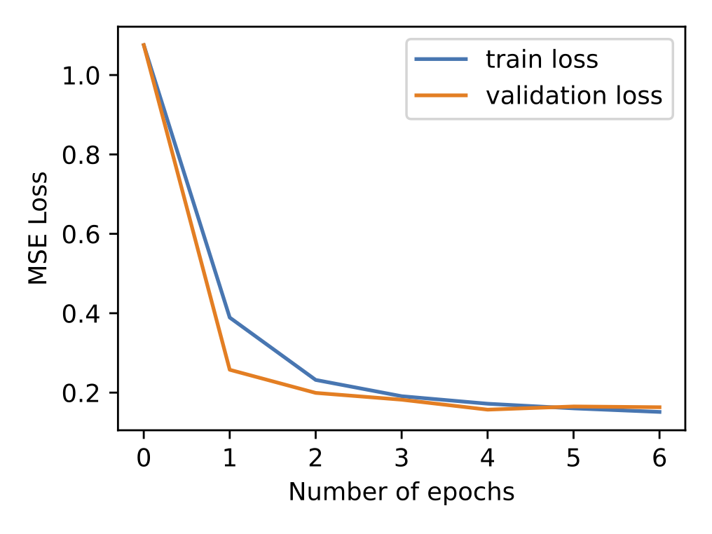

### Inference Results
To judge the performence of the Transformer, it is first applied to spectra from a reference box. This box has the cosmological parameters found by the [Planck 2015](    https://doi.org/10.1051/0004-6361/201525830) study and was never seen during training. $\Omega_m$ and
$\Omega_\Lambda$ are predicted accurately with sharp peaks, while $\Omega_b$ and $h$ have wider distributions centered generally
around the correct values.
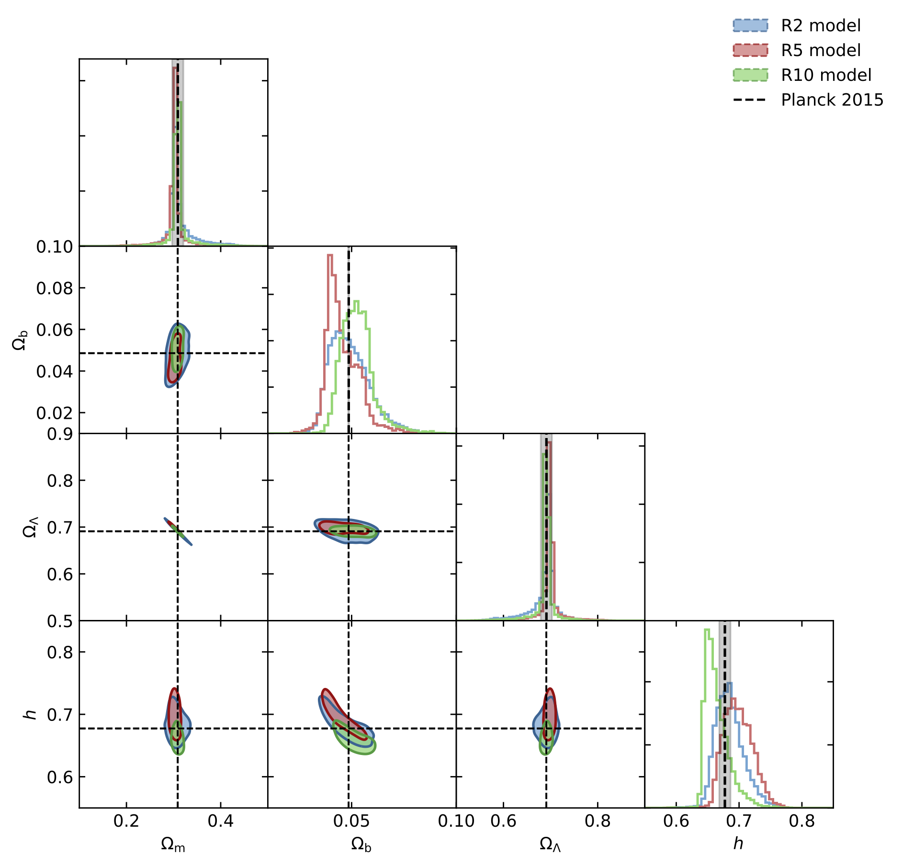

---
Finally the Transformer is also applied to observed spectra from the SDSS survey. The predictions for $\Omega_m$ and $\Omega_\Lambda$ are in agreement with the Planck measurements, while $h$ also is in agreement with the Planck value, although our models seem to favor higher values. $\Omega_b$ is significantly underestimated by the models. For a discussion of this behaviour see the written theses.
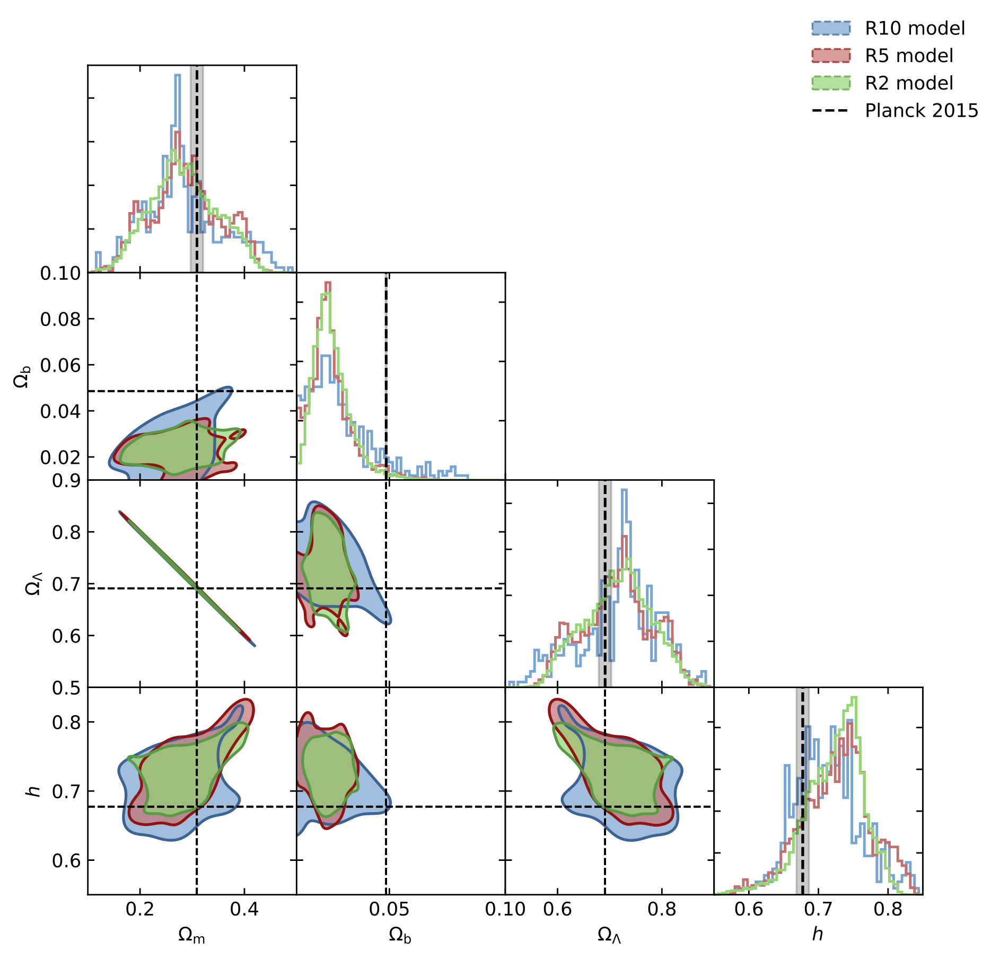
